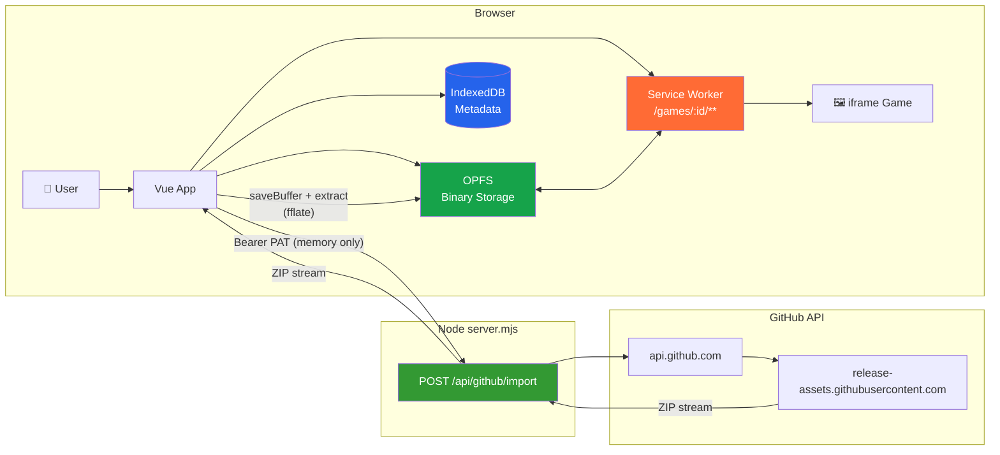
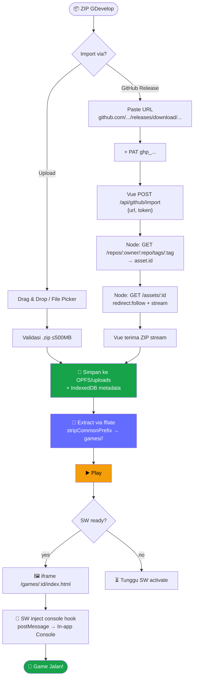
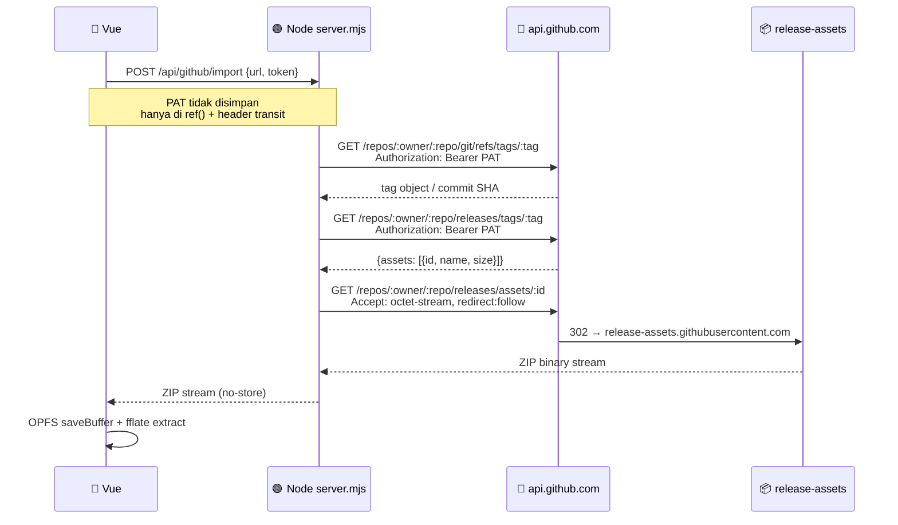
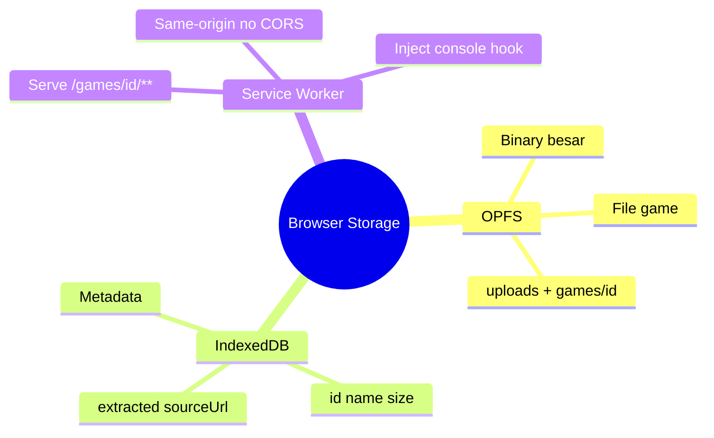
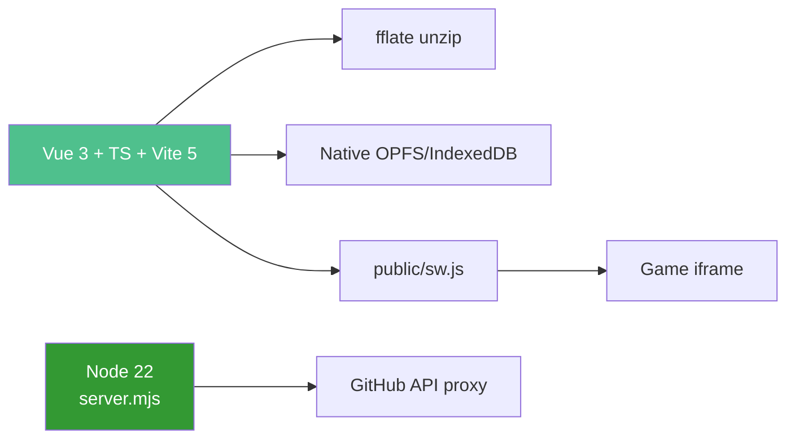
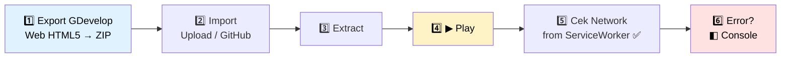
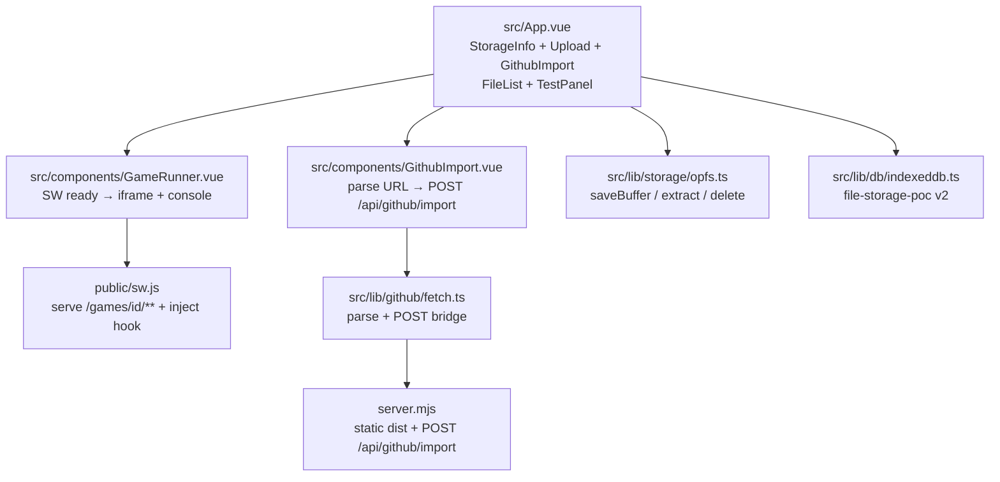

# 🎮 Browser Storage POC — Vue + Node

> **Upload ZIP / Import GitHub Release → Extract → Play** langsung di browser.<br/>
> Game GDevelop HTML5 tanpa hosting, 100% client-side via **OPFS + IndexedDB + Service Worker**.

<p>
  
  
  
  
  
  
</p>

---

## 🗺️ Arsitektur



---

## 🔄 Alur Lengkap



---

## 🔐 Sequence — GitHub Private Release



---

## 🎯 Kenapa Ada

GDevelop butuh web server untuk `index.html/js/wasm/audio`. PoC ini ganti server dengan storage browser:



---

## ✨ Fitur

| Fitur | Deskripsi |
|-------|-----------|
| 📤 **Upload ZIP** | `.zip` ≤500 MB → OPFS + IndexedDB |
| 🔒 **Import GitHub Privat** | Paste URL + `ghp_...` (memory-only). Node handle `GET /repos/.../tags/{tag} → asset.id → GET /assets/{id}` dengan stream — tanpa CORS fail |
| 📂 **Extract & Play** | `fflate` + `stripCommonPrefix` + progress + `GameRunner` iframe + SW `/games/` + fullscreen + open new tab |
| 🖥️ **In-app Console** | Accordion overlay (default) atau docked, toggle `Bottom/Right`, filter/copy/clear, tangkap `console.*` + `error`/`unhandledrejection` via SW inject + `postMessage` |
| 💾 **Storage Info & Tests** | `navigator.storage.estimate()` + Test OPFS/IndexedDB + Clear All |

---

## 🧱 Stack



**Vue 3 + TypeScript + Vite 5** · **Node 22** (`server.mjs`) · `fflate` · Native OPFS/IndexedDB · `public/sw.js`

---

## 🚀 Quick Start

```bash
npm install
npm run dev      # http://localhost:5173 (Vite handle /api/github/import)
npm run build    # Vite → dist/
npm run start    # node server.mjs serve dist + /health + /api/github/import (port 80)
```

**Docker** (single container `node:22-alpine`, tanpa nginx / tanpa `ENV` token):

```bash
docker build -t poc .
docker run -p 80:80 poc  # /health OK
# compose: 127.0.0.1:18530:80 → gdevelop-network
```

---

## 🎮 Cara Pakai GDevelop



1. Export GDevelop → Web (HTML5) → ZIP (pastikan `index.html` di root; jika `game/index.html` otomatis di-strip)
2. Import via Upload atau GitHub Release → **Extract** → **▶ Play** → cek Network `(from ServiceWorker)`
3. Play error? Buka `◧ Console` di header runner — toggle `Overlay/Docked` & `Bottom/Side`

---

## 📁 Struktur



| File | Peran |
|------|-------|
| `public/sw.js` | Serve `/games/<id>/**` dari OPFS + inject console hook (html) |
| `src/App.vue` | StorageInfo + FileUpload + GithubImport \| FileList + TestPanel |
| `src/components/GithubImport.vue` | Parse URL → POST `/api/github/import` (Bearer) |
| `src/components/GameRunner.vue` | SW ready → iframe + console accordion |
| `src/lib/github/fetch.ts` | Parse + POST bridge |
| `src/lib/storage/opfs.ts` | saveBuffer/extractGameToOPFS/deleteGame |
| `src/lib/db/indexeddb.ts` | file-storage-poc v2 |
| `server.mjs` | Static dist + POST `/api/github/import` (private, no-store, stream) |

> 🔒 **Secure:** PAT hanya di `ref()` Vue & header `Authorization` transit ke Node → GitHub, tidak masuk `localStorage/IndexedDB/OPFS/URL`.

---

PoC — bebas eksperimen. ✨
